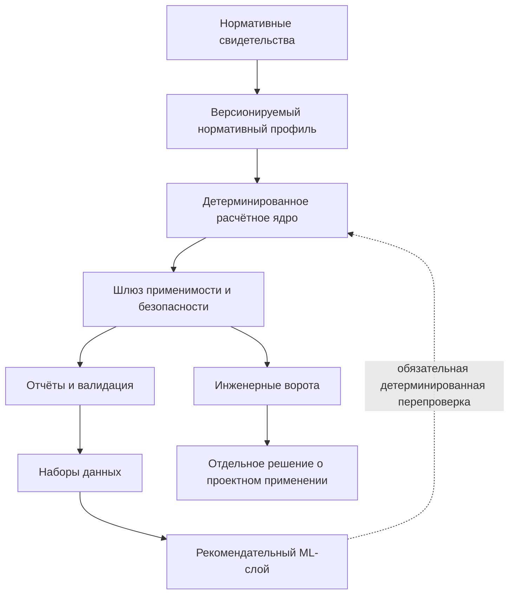

# Архитектура миграции

## Источники

- `USR-2026-07-16` — консолидированное задание текущего чата: требования к
  доказательности от 2026-07-15 и разрешение продолжить от 2026-07-16.
- `REPO` — архитектура текущего GBK по `AGENTS.md`, документации и структуре
  `src/sp63_core`.
- `SP63-EVID` — [сводка нормативного источника](../normative_sources/SP63_2018_AMD1_AMD2_evidence.md),
  SHA-256 `8dfe7fc1af47d6adf2a4d91ed91ee92fe0762abe20a0c54b3c248c7ff138fe00`.

## Целевая логическая схема

| ID | Решение или утверждение | Источник | Статус | Влияние на архитектуру | Требуется инженерная проверка |
|---|---|---|---|---|---|
| `AR-00` | Нижеследующая схема является целевой гипотезой миграции, а не описанием завершённой реализации. | `USR-2026-07-16`; `REPO` | `ASSUMPTION` | Схема задаёт допустимое направление зависимостей и будущие границы модулей. | Да |

## Ответственность слоёв

| ID | Решение или утверждение | Источник | Статус | Влияние на архитектуру | Требуется инженерная проверка |
|---|---|---|---|---|---|
| `AR-01` | Слой свидетельств хранит идентификатор документа, редакцию, дату, SHA-256, страницы, пункты, таблицы и границы доказательной силы. | `USR-2026-07-16`; `SP63-EVID` | `ASSUMPTION` | Источник не встраивается в вычислительную функцию и может проверяться независимо. | Да |
| `AR-02` | Нормативный профиль связывает значения каталога с одним проверяемым комплектом источников. | `USR-2026-07-16`; `REPO` | `ASSUMPTION` | Запрещается неявное смешение редакций и неподписанных значений. | Да |
| `AR-03` | Детерминированное ядро включает материалы, геометрию, проверки и проектировочные маршруты; оно не получает нормативного одобрения из факта прохождения тестов. | `REPO` | `CONFIRMED` | Программная корректность и инженерная правильность учитываются раздельно. | Да |
| `AR-04` | Шлюз применимости проверяет поддержанную область до публикации расчётной способности. | `USR-2026-07-16`; `REPO` | `CONFIRMED` | Непокрытые п. 8.1.3, длительный режим и иные условия сохраняют неполный либо безопасно остановленный результат. | Да |
| `AR-05` | Отчёты и валидация обязаны переносить профиль источника, статусы доказательности и ограничения без их повышения. | `USR-2026-07-16`; `REPO` | `ASSUMPTION` | Последующий артефакт не может стать надёжнее породившего его расчёта. | Да |
| `AR-06` | BMR-01–BMR-05 остаются регрессиями с предположительными ожидаемыми значениями. | `USR-2026-07-16`; `REPO` | `ASSUMPTION` | Эталонная программная валидация не заменяет независимый расчёт и утверждение допуска. | Да |
| `AR-07` | Наборы данных могут включать только явные сведения о профиле, применимости и безопасности. | `REPO` | `ASSUMPTION` | Строки с неполной или запрещённой расчётной ветвью не становятся положительным обучающим доказательством. | Да |
| `AR-08` | ML выдаёт рекомендацию, после которой выполняется детерминированная перепроверка. | `USR-2026-07-16`; `REPO` | `CONFIRMED` | ML не имеет прямого пути к проектному решению или снятию защитных статусов. | Да |
| `AR-09` | `requires_engineer_review=true` и `project_use=false` сохраняются до отдельного разрешения. | `USR-2026-07-16`; `REPO` | `CONFIRMED` | Инженерные ворота располагаются после технической валидации, а не подменяются ею. | Да |

## Открытые архитектурные решения

| ID | Вопрос | Источник | Статус | Влияние на архитектуру | Требуется инженерная проверка |
|---|---|---|---|---|---|
| `AR-Q1` | Как фиксировать юридическую актуальность нормативного профиля после Изм. № 2? | `USR-2026-07-16`; `SP63-EVID` | `OPEN_QUESTION` | Определяет жизненный цикл и отзыв профилей. | Да |
| `AR-Q2` | Какую структуру результата использовать для раздельных статусов формулы, источника, применимости, валидации и проектного допуска? | `REPO` | `OPEN_QUESTION` | Определяет контракты API, отчётов и наборов данных. | Да |
| `AR-Q3` | Как включить п. 8.1.3 без изменения проверенной последовательности остальных условий? | `USR-2026-07-16`; `SP63-EVID` | `OPEN_QUESTION` | Определяет новый предрасчётный шлюз ULS-изгиба. | Да |
| `AR-Q4` | Как передавать длительный контекст через проверки, проектировочный маршрут, отчёты, наборы данных и машинное обучение без частичного применения? | `USR-2026-07-16`; `REPO` | `OPEN_QUESTION` | Требует единого сквозного контракта и отказа при потере контекста. | Да |
